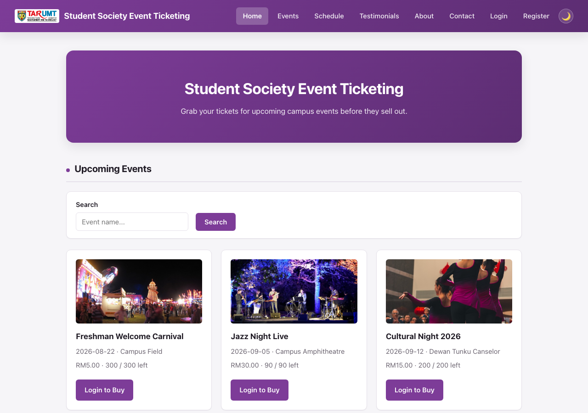
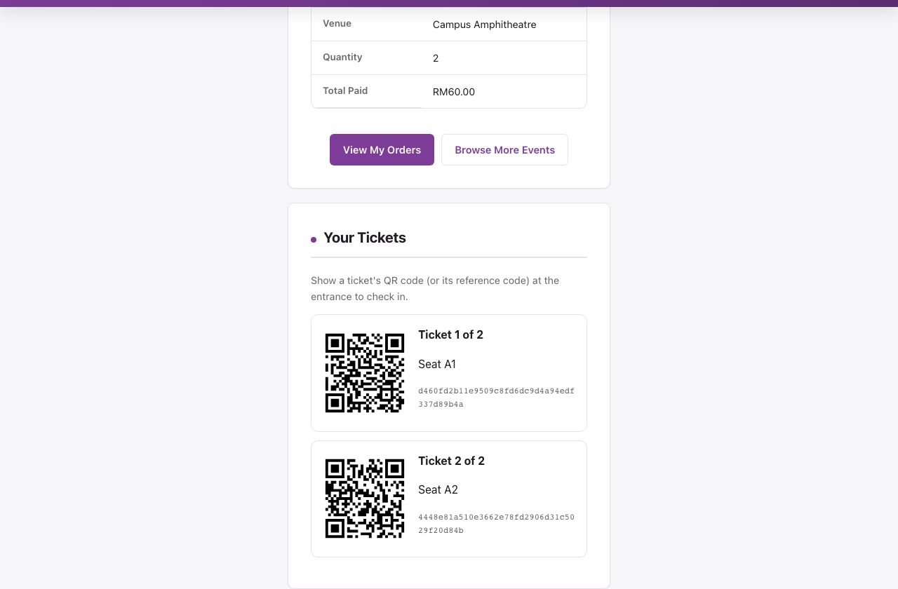

# CampusHop — Campus Shuttle Bus Booking Platform

A minimal PHP + MySQL CRUD web app for the **AMIT3253 Cloud Computing for Business**
capstone assignment. Students and staff browse upcoming campus shuttle **trips**
(route + date + departure time), reserve a number of seats against that trip's live
capacity, and get an instant free confirmation with a QR **boarding pass** per seat
booked — no payment step, no seat map, just quantity-based booking. Use this folder
as-is as your Phase 2/3 starting point so you can focus on the AWS infrastructure
(VPC, EC2, RDS, ELB, ASG) instead of writing app code from scratch.


*Homepage — browse shuttle trips as route cards, book seats by quantity.*


*Confirmation page — one QR boarding pass per seat, generated client-side, for admin check-in.*

## Features

**Public site**
- Browse shuttle trips as route cards, with search by route name on the homepage.
- Book seats by quantity against a trip's `capacity` / `seats_booked` — the app won't
  let you book more seats than remain. A fully booked trip can't even be selected in
  the first place: its "Book Seats" button on the homepage becomes a disabled "Fully
  Booked" button, and its option in the trip dropdown is disabled too, not just
  rejected after you try.
- **Instant, free booking.** Pick a trip, choose a seat quantity, confirm — there is
  no price, no payment step, and no two-step checkout. The service is entirely free.
- **QR boarding pass + check-in.** After a successful booking, every seat booked gets
  its own QR code on the confirmation page (rendered client-side, no external service
  call — see `assets/js/qrcode.js`). The QR encodes a long random token, **not** the
  passenger's name/email, so a photographed or glimpsed QR code can't leak personal
  info; admin's `admin/checkin.php` looks up the passenger/trip from that token and
  marks the boarding pass as boarded, safely idempotent if scanned twice.
- "My Bookings" on the homepage, with edit/cancel for your own bookings and a "View
  Boarding Pass" link back to the QR codes. Editing seat quantity re-validates against
  the trip's remaining capacity, exactly like creating a new booking.
- Register/login/logout, account page, dark/light mode, password visibility toggle,
  TAR UMT faculty dropdown at registration.
- Contact form and testimonials (reviews), both moderated by admin.

**Admin panel** (`admin/`, gated by an `is_admin` flag — admins land directly on
`admin/trips.php`, never the public site)
- Full CRUD for trips: route name, date, departure time, pickup point, drop-off
  point, capacity, photo. Trip date cannot be set in the past, and capacity can't be
  reduced below what's already booked.
- View/cancel any user's booking, and see how many of each booking's seats have
  boarded.
- **`admin/checkin.php`** — paste or scan a boarding pass's QR token to look up the
  passenger, trip, and pickup point, then mark them boarded. Re-scanning an
  already-boarded pass shows the original check-in time instead of a second "Mark
  Boarded" button.
- Moderate testimonials and view contact messages.
- Manage user accounts: promote/demote admin access, delete an account (cascades — deleting a user also deletes all of their bookings/boarding passes and testimonials in the same transaction, so there's nothing left over to clean up manually), or create a brand-new admin account directly (`admin/user_create.php`) without needing that person to self-register first. An admin can never delete or demote their own account.

There's deliberately **no admin dashboard** (`admin/index.php`) and no notification
system — those are left as exercises using the same query/render patterns as the
other admin pages.

## Tech stack

Plain procedural PHP (no framework) + MySQL via `mysqli`. All queries use prepared
statements and all output is escaped with `htmlspecialchars()` — these are safe
patterns to reuse elsewhere in your project.

## Requirements

- PHP 8.x with the `mysqli` extension
- MySQL 5.7+ / MariaDB / Amazon RDS (MySQL-compatible)
- A web server (Apache/Nginx) or just `php -S` for local testing

## Quick start (local)

1. Create the database and import the schema (this also seeds an admin account and
   six sample shuttle trips across different campus routes):
   ```
   mysql -u root -p -e "CREATE DATABASE campushop_db"
   mysql -u root -p campushop_db < schema.sql
   ```
2. Point `config.php` at your MySQL instance — either edit the fallback values
   directly, or export environment variables before starting PHP:
   ```
   DB_HOST=localhost DB_USER=root DB_PASS=yourpassword DB_NAME=campushop_db
   ```
3. Serve the folder, e.g.:
   ```
   php -S localhost:8000
   ```
4. Visit `http://localhost:8000/` for the public site, or log in with the seeded
   admin account below to reach the admin panel.

## Default admin login

```
Email:    admin@example.com
Password: admin123
```

**Change this password (or the seed row in `schema.sql`) before deploying anywhere
beyond a local demo** — it's a well-known credential once this code is shared.
Regular users register their own accounts via the Register page.

## Project structure

| Path | Purpose |
|---|---|
| `schema.sql` | Creates the database, all tables, and seed data |
| `config.php` | Database connection — reads `DB_HOST`/`DB_USER`/`DB_PASS`/`DB_NAME`, plus S3 photo storage config |
| `healthz.php` | ALB health check target — `200` if the DB connection works, `500` otherwise |
| `auth.php` | Session helpers: `current_user_id()`, `require_login()`, `require_admin()`, etc. |
| `helpers.php` | Image upload/delete helpers, faculty list, entity image URL resolver |
| `register.php` / `login.php` / `logout.php` | Account creation and session login (passwords hashed, never plaintext) |
| `index.php` | Public landing page — trip cards + "My Bookings" |
| `create.php` / `edit.php` / `delete.php` | Booking CRUD, requires login + ownership |
| `confirmation.php` | Booking confirmation + one QR boarding pass per seat |
| `trips.php`, `schedule.php`, `about.php`, `contact.php`, `testimonials.php` | Public informational pages |
| `partials/header.php` / `partials/footer.php` | Shared navbar/footer, included by every page |
| `admin/` | Admin-only CRUD for trips, bookings, testimonials, messages, users, plus `admin/checkin.php` for QR boarding pass check-in |
| `assets/js/qrcode.js` | Vendored client-side QR code generator ([kazuhikoarase/qrcode-generator](https://github.com/kazuhikoarase/qrcode-generator), MIT) — no external network calls at runtime |
| `uploads/` | Uploaded trip/route photos |
| `style.css` | Shared styling (navbar, cards, forms, tables, tickets, dark/light mode) |

## Trip photos: local disk by default, S3 already wired up (just needs your bucket)

Uploads are validated with `getimagesize()` (not just the file extension) and capped
at 5MB. Where they're stored depends on `AWS_S3_BUCKET` in `config.php`:
- **Unset (default)**: saved into `uploads/`, `trips.image_url` stores a path like
  `/uploads/trip_xxx.jpg`. Nothing to configure.
- **Set**: uploaded to that S3 bucket instead (hand-written Signature Version 4
  signing over PHP's built-in stream wrapper — no AWS SDK, no Composer), and
  `image_url` stores the full object URL.

**This doesn't move anything already stored.** The demo photos seeded via
`schema.sql` (and any photo uploaded before `AWS_S3_BUCKET` was set) already have a
local `/uploads/...` path saved in the database — switching S3 on only affects the
*next* upload/replace through the admin panel, it doesn't rewrite existing rows.
Migrating those existing local images to S3 isn't built here; that's left as an
exercise.

Credentials are tried two ways: first an IAM role attached to the EC2 instance (via
the metadata service, nothing hardcoded), and if that's not available — e.g. an AWS
Academy Learner Lab where you can't attach or inspect IAM roles yourself — explicit
`AWS_ACCESS_KEY_ID`/`AWS_SECRET_ACCESS_KEY`/`AWS_SESSION_TOKEN`. Set these in a
`.env` file (copy `.env.example` to `.env`, fill in the values from the lab's "AWS
Details" panel — `.env` is git-ignored, so it's never committed to this public repo),
or as Apache environment variables if you'd rather not use a file. Those temporary
credentials expire and rotate periodically — if uploads that were working suddenly
fail, refresh them and, if using `.env`, no restart is needed.

This matters once there's more than one EC2 instance behind the ALB — a photo saved to
local disk only exists on whichever instance handled the upload, so any other instance
shows a broken image for it. **What's still on you**: creating the bucket + a public-read
bucket policy (or CloudFront), getting one of the two credential methods above working,
and setting `AWS_S3_BUCKET`/`AWS_S3_REGION`. The signing logic is verified against AWS's
own SigV4 test vectors, the local-disk path is tested live end-to-end, and a signed
request with fake credentials was confirmed to reach a real S3 endpoint and get a
structured `403` back (not a crash/hang) — but a full successful round-trip against a
real bucket with real credentials hasn't been tested, since there wasn't one available
here.

Notes for EC2 deployment:
- `uploads/` needs to be writable by the web server user: `chmod 775 uploads` after
  copying the app to `/var/www/html/`.
- PHP's default `upload_max_filesize` (often 2M) is smaller than the 5MB this app
  allows — bump it in `php.ini`:
  ```
  upload_max_filesize = 10M
  post_max_size = 12M
  ```
  then restart the web server.
- Point your ALB target group's health check at `healthz.php` — it returns `200` only
  if the database connection actually succeeds (`500` otherwise), so a target that
  can't reach RDS gets correctly pulled out of rotation instead of still receiving
  traffic.

## Phase 2: running it on a single EC2 instance

1. **Launch the instance**: EC2 console → Launch Instance → Amazon Linux 2023 AMI,
   `t2.micro`/`t3.micro` (free-tier eligible). Create or select a key pair (download
   the `.pem` if new) — you'll need it to SSH in.
2. **Security group**: allow inbound `SSH (22)` from your IP only, and `HTTP (80)`
   from `0.0.0.0/0` (the assignment's assumptions say HTTPS isn't required for this
   proof of concept). Leave all other ports closed.
3. **Connect via SSH** once the instance is "running" and you have its public IPv4
   address:
   ```
   chmod 400 your-key.pem
   ssh -i your-key.pem ec2-user@<public-ipv4>
   ```
4. **Install a LAMP stack** on the instance:
   ```
   sudo dnf install -y httpd php php-mysqli mariadb105-server
   sudo systemctl enable --now httpd mariadb
   ```
5. **Copy this folder onto the instance** (run from your local machine, not the SSH
   session):
   ```
   scp -i your-key.pem -r ./campushop ec2-user@<public-ipv4>:/tmp/
   ```
   Then on the instance:
   ```
   sudo cp -r /tmp/campushop/* /var/www/html/
   sudo chown -R apache:apache /var/www/html
   sudo chmod -R 775 /var/www/html/uploads
   ```
6. **Secure MySQL/MariaDB**, create a DB user, then import the schema:
   ```
   sudo mysql_secure_installation
   mysql -u root -p < schema.sql
   ```
7. **Point the app at the database**: copy `.env.example` to `.env` and set
   `DB_HOST`/`DB_USER`/`DB_PASS`/`DB_NAME` there to match your MySQL
   credentials (`config.php` loads `.env` automatically - see the loader at
   the top of the file; `.env` is git-ignored so it's never committed). Or,
   if you'd rather not use a file, edit `config.php` directly, or export the
   same names as Apache environment variables via a `SetEnv` directive in
   `/etc/httpd/conf.d/`.
8. **Test it**: open `http://<public-ipv4>/` in a browser.

## Phase 3: moving the database to RDS

1. Create an RDS MySQL instance in a private subnet (per the assignment's VPC
   design).
2. From an EC2 instance in the same VPC, run `schema.sql` against the RDS endpoint:
   ```
   mysql -h <rds-endpoint> -u <user> -p < schema.sql
   ```
3. Set `DB_HOST` (and `DB_USER`/`DB_PASS`/`DB_NAME` if different) on the web server
   to the RDS endpoint — `config.php` does not need to change.
4. Restrict the RDS security group to only accept traffic from the web/app tier's
   security group, on port 3306.

## A note on authentication and the assignment brief

The assignment's own assumptions state the platform "is publicly accessible to
end-users without requiring a user login, registration, or authentication
gateway" — login/registration is **not** required to satisfy the "Functional"
rubric criterion. It's included here because it makes the demo feel like a real
product and is a reasonable "advanced feature" to point to in the Part 2
demonstration. If you'd rather keep things simpler, you can delete `auth.php`,
`register.php`, `login.php`, `logout.php`, the `require_login()` calls, and the
`user_id` column/joins — the CRUD logic underneath is unaffected either way.

## Extending for extra marks

This app covers CRUD, accounts, a baseline admin panel, and live seat-capacity
tracking. Ideas for going further:
- An admin dashboard: stats tiles (total bookings, seats boarded, upcoming trips)
  plus graphs of bookings over time, broken down per route, so an admin can see
  which routes are busiest.
- A booking status workflow (pending/confirmed/boarded) instead of instant-confirm.
- Live chat between a user and admin (not a chatbot — a real-time message thread) for support questions, e.g. a `messages` table keyed by conversation with sender/recipient, polled or long-polled for new messages.
- Cap how many seats a single account can book per trip, so one account can't book
  up an entire trip's capacity.
- Wire trip photo uploads to Amazon S3 (see above).
- A REST/JSON API layer for load testing tools (Apache Bench, JMeter, Locust) to hit
  directly.
