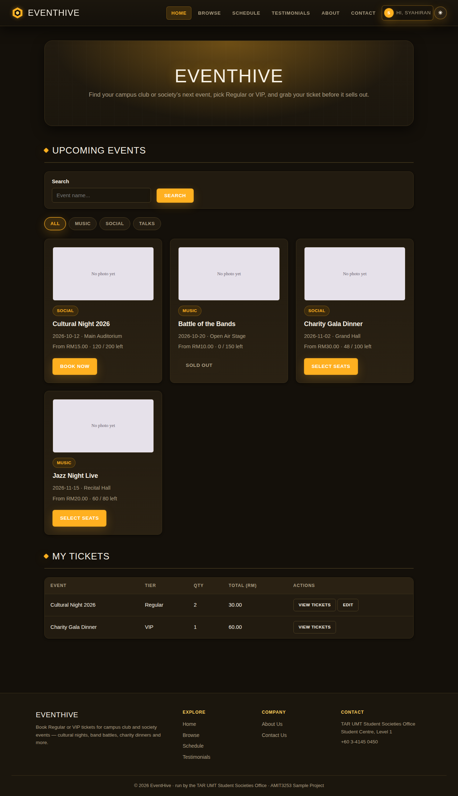
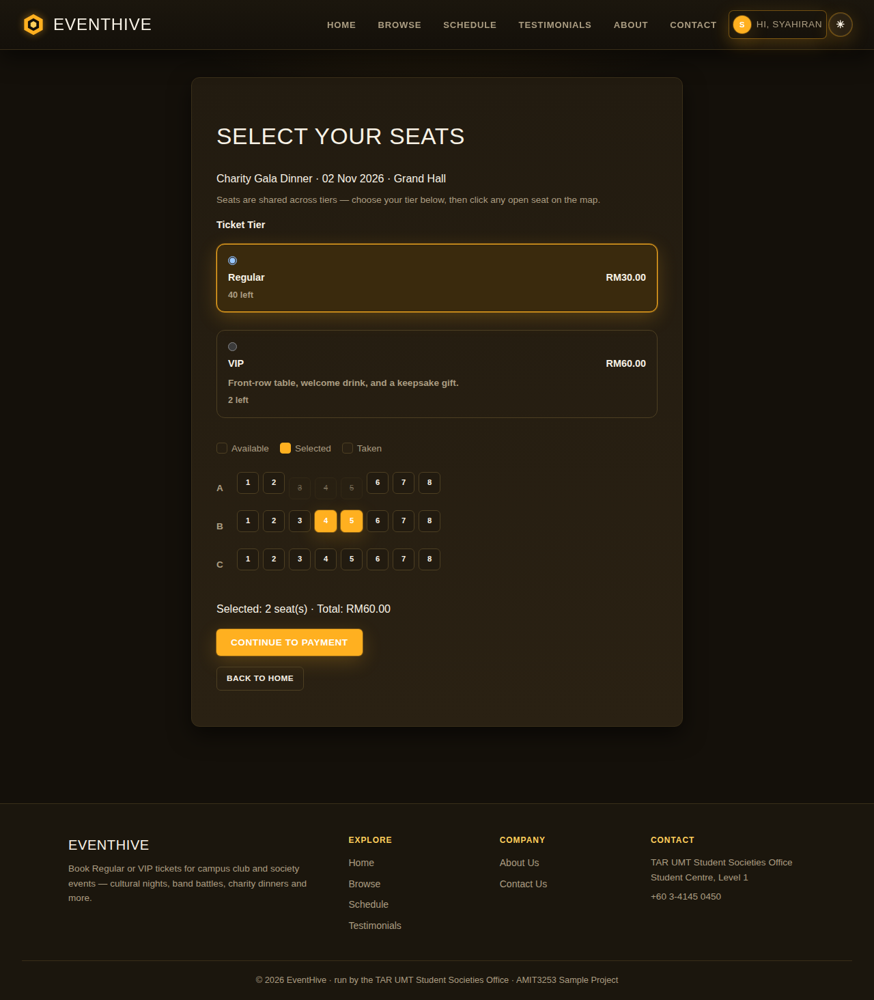
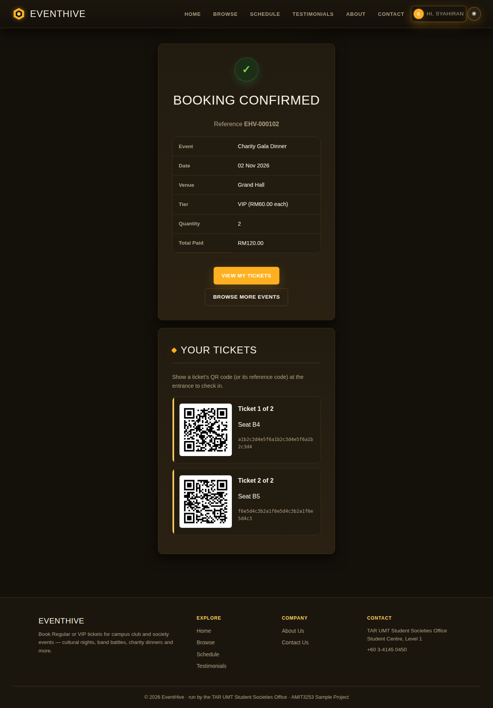

# EventHive

A minimal PHP + MySQL CRUD web app for the **AMIT3253 Cloud Computing for Business**
capstone assignment at TAR UMT. Students browse campus club/society events (concerts,
society nights, talks), book **Regular or VIP tickets** against a live per-tier
inventory count, and simulate paying for them.

This is a from-scratch restructure of the teacher-provided "event ticketing" demo, kept
in the same general topic (campus event ticketing) but rebuilt with a distinct name,
visual identity, and a genuinely different data model (ticket tiers) and navigation
shape, per the assignment's requirement that submissions not look like a copy of the
demo. Use this folder as your Phase 2/3 starting point so you can focus on the AWS
infrastructure (VPC, EC2, RDS, ELB, ASG) instead of writing app code from scratch.


*Homepage — browse events as photo cards, general admission or assigned seating.*


*`seat_select.php` — pick exact seats for events with assigned seating.*


*Confirmation page — one QR code per ticket, generated client-side, for admin check-in.*

## What makes EventHive different from the base demo

- **New brand**: "EventHive" name, an inline SVG hexagon/honeycomb logo (no image
  asset, no reused TAR UMT logo graphic), and a warm amber/gold color theme in place of
  the original's purple/red theme — in both the dark (default) and light (toggle) modes.
- **Ticket tiers, not a single flat price.** Every event has 1 or more pricing tiers
  (`ticket_tiers` table) — most events just have one "Regular" tier (functionally the
  same as the original's flat price), but a few have a second, pricier "VIP" tier with
  its own perks description and its own slice of the inventory. See "Design decision:
  tiers and seating" below for exactly how this interacts with assigned seating.
- **Categories.** Every event has a light-weight `category` (Music / Sports /
  Workshops / Talks / Social), filterable on the homepage alongside the existing name
  search.
- **Restructured navigation.** The public "browse all events" page is `browse.php`
  (was `events.php`); orders are called "My Tickets" / "reservations" everywhere in the
  UI (the underlying table is still named `orders` — see below).

## Design decision: tiers and seating

Each event now supports 1-2 pricing tiers (`ticket_tiers`) instead of a single flat
`events.ticket_price`. A buyer picks a tier first (skipped automatically when an event
only has one tier), then either a quantity (general admission) or exact seats
(assigned seating).

For events with assigned seating, the seat **map** is deliberately kept
**tier-agnostic**: `seats` is still keyed only by `event_id`, exactly as in the
original demo, not by `tier_id`. A buyer picks a tier, then picks any open seat on the
shared map — the seat itself doesn't encode "this row is VIP." The alternative
(front rows = VIP seats, back rows = Regular, i.e. adding `seats.tier_id`) was
considered and rejected for this project: it would mean allocating rows to tiers at
creation time, teaching the seat picker to filter/color by the buyer's chosen tier, and
reconciling "how many VIP seats are left" against `ticket_tiers.total_tickets` in two
places at once. That's a real feature, but it roughly doubles the surface area of
`seat_select.php` and `payment.php` for a class assignment, and the two counts could
drift out of sync if an admin ever edited a tier. Keeping seats tier-agnostic means
`ticket_tiers.total_tickets`/`tickets_sold` is the **only** inventory count for a tier,
and the seat map only tracks "is this physical seat free" — simpler to implement
correctly and reason about. This decision is also documented as a comment at the top
of `schema.sql`.

## Design decision: "orders" vs. "reservations" / "My Tickets"

The underlying database table is still named `orders` (renaming it everywhere would
touch every query in the app for no functional gain). Every **user-facing** label,
however, says "My Tickets" (homepage section, confirmation page) or "reservation"
(edit/cancel actions, admin panel) — never "order." If you rename the table too, be
exhaustive: every `orders` reference (its own table, all its foreign keys in `tickets`
and — now — `orders.tier_id`, and every query across the app) needs to be updated
together, or you'll get "table not found" errors.

## Features

**Public site**
- Browse events as photo cards, with search and category filtering on the homepage,
  and a dedicated `browse.php` listing.
- Book tickets by quantity against a chosen tier's `total_tickets` / `tickets_sold` —
  the app won't let you book more tickets than remain **in that tier**. A sold-out
  event (or sold-out tier) can't even be selected in the first place: its "Book Now"
  button becomes a disabled "Sold Out" button, and its tier option is disabled too, not
  just rejected after you try.
- **`payment.php`** — a two-step simulated checkout (review → confirm) supporting
  either card details or FPX bank transfer, with server-side validation branching on
  the selected payment method. The total is always the selected tier's price × quantity.
- **Assigned seating for events that need it.** An event can optionally have
  `has_seating` turned on with a rows × seats-per-row layout (`seat_select.php`) —
  buyers pick a tier, then click their exact seats on a live map (taken seats are
  greyed out) instead of just picking a quantity. Booking a seat is concurrency-safe
  (`SELECT ... FOR UPDATE` on the chosen seat rows and the tier's inventory row inside
  a transaction), so two buyers can't land the same seat (or oversell a tier) in a
  race. Events without seating keep the original quantity-based flow.
- **QR ticket + check-in.** After a successful payment, every ticket purchased (one
  per seat, or one per unit for quantity-based events) gets its own QR code on the
  confirmation page (rendered client-side, no external service call — see
  `assets/js/qrcode.js`). The QR encodes a long random token, **not** the attendee's
  name/email, so a photographed or glimpsed QR code can't leak personal info; admin's
  `admin/checkin.php` looks up the attendee/event/seat from that token and marks the
  ticket present, safely idempotent if scanned twice.
- "My Tickets" on the homepage, with edit/cancel for your own reservations and a "View
  Tickets" link back to the QR codes. Editing quantity is disabled for seated-event
  reservations (cancel and rebook instead, since a specific seat can't be reassigned by
  just changing a number).
- Register/login/logout, account page, dark/light mode, password visibility toggle,
  TAR UMT faculty dropdown at registration.
- Contact form and testimonials (reviews), both moderated by admin.

**Admin panel** (`admin/`, gated by an `is_admin` flag — admins land directly on
`admin/events.php`, never the public site)
- Full CRUD for events: name, date, venue, category, photo, and 1-3 ticket tiers (name,
  price, inventory, optional perks) per event. Event date cannot be set in the past,
  and a tier's total tickets can't be reduced below what's already sold on that tier,
  nor can a tier with sales be removed. Optionally toggle assigned seating (rows ×
  seats per row) at creation time — the seat map is generated immediately and can't be
  changed afterwards (only the event's other details and tiers stay editable), and the
  combined tier ticket count can't exceed the seat map's capacity.
- View/cancel any user's reservation, and see how many of each reservation's tickets
  have been checked in.
- **`admin/checkin.php`** — paste or scan a ticket's QR token to look up the
  attendee, event, seat, and tier, then mark them present. Re-scanning an
  already-checked-in ticket shows the original check-in time instead of a second "Mark
  Present" button.
- Moderate testimonials and view contact messages.
- Manage user accounts: promote/demote admin access, delete an account (cascades — deleting a user also deletes all of their bookings/reservations/tickets and testimonials in the same transaction, restoring ticket-tier inventory, so there's nothing left over to clean up manually), or create a brand-new admin account directly (`admin/user_create.php`) without needing that person to self-register first. An admin can never delete or demote their own account.

There's deliberately **no admin dashboard** (`admin/index.php`) and no notification
system — those are left as exercises using the same query/render patterns as the
other admin pages.

## Tech stack

Plain procedural PHP (no framework) + MySQL via `mysqli`. All queries use prepared
statements and all output is escaped with `htmlspecialchars()` — these are safe
patterns to reuse elsewhere in your project.

## Requirements

- PHP 8.x with the `mysqli` extension
- MySQL 5.7+ / MariaDB / Amazon RDS (MySQL-compatible)
- A web server (Apache/Nginx) or just `php -S` for local testing

## Quick start (local)

1. Create the database and import the schema (this also seeds an admin account and
   six sample events — three general-admission, three with assigned seating — each
   with a real seat map generated automatically, and their ticket tiers: three events
   with a single "Regular" tier, three with both "Regular" and "VIP" tiers):
   ```
   mysql -u root -p -e "CREATE DATABASE eventhive_db"
   mysql -u root -p eventhive_db < schema.sql
   ```
2. Point `config.php` at your MySQL instance — either edit the fallback values
   directly, or export environment variables before starting PHP:
   ```
   DB_HOST=localhost DB_USER=root DB_PASS=yourpassword DB_NAME=eventhive_db
   ```
3. Serve the folder, e.g.:
   ```
   php -S localhost:8000
   ```
4. Visit `http://localhost:8000/` for the public site, or log in with the seeded
   admin account below to reach the admin panel.

## Default admin login

```
Email:    admin@example.com
Password: admin123
```

**Change this password (or the seed row in `schema.sql`) before deploying anywhere
beyond a local demo** — it's a well-known credential once this code is shared.
Regular users register their own accounts via the Register page.

## Project structure

| Path | Purpose |
|---|---|
| `schema.sql` | Creates the database, all tables (including `ticket_tiers`), and seed data — read the design-decision comment at the top before changing the booking flow |
| `config.php` | Database connection — reads `DB_HOST`/`DB_USER`/`DB_PASS`/`DB_NAME`, plus S3 photo storage config |
| `healthz.php` | ALB health check target — `200` if the DB connection works, `500` otherwise |
| `auth.php` | Session helpers: `current_user_id()`, `require_login()`, `require_admin()`, etc. |
| `helpers.php` | Image upload/delete helpers, faculty list, entity image URL resolver |
| `register.php` / `login.php` / `logout.php` | Account creation and session login (passwords hashed, never plaintext) |
| `index.php` | Public landing page — event cards (with category filter + search) + "My Tickets" |
| `create.php` / `edit.php` / `delete.php` | Reservation CRUD, tier-aware, requires login + ownership |
| `seat_select.php` | Tier + seat-map picker for events with `has_seating = 1` |
| `payment.php` | Simulated checkout (card or FPX); price/inventory always driven by the selected tier; creates one `tickets` row (with QR token) per seat/unit purchased |
| `confirmation.php` | Reservation receipt + one QR code per ticket |
| `browse.php`, `about.php`, `contact.php`, `testimonials.php`, `schedule.php` | Public informational pages |
| `partials/header.php` / `partials/footer.php` | Shared navbar/footer (EventHive logo + branding), included by every page |
| `admin/` | Admin-only CRUD for events (incl. tiers), reservations, testimonials, messages, users, plus `admin/checkin.php` for QR ticket check-in |
| `assets/js/qrcode.js` | Vendored client-side QR code generator ([kazuhikoarase/qrcode-generator](https://github.com/kazuhikoarase/qrcode-generator), MIT) — no external network calls at runtime |
| `uploads/` | Uploaded event photos |
| `style.css` | Shared styling (navbar, cards, forms, tables, seat map, tickets, tier picker, category chips, dark/light mode) |

## Event photos: local disk by default, S3 already wired up (just needs your bucket)

Uploads are validated with `getimagesize()` (not just the file extension) and capped
at 5MB. Where they're stored depends on `AWS_S3_BUCKET` in `config.php`:
- **Unset (default)**: saved into `uploads/`, `events.image_url` stores a path like
  `/uploads/event_xxx.jpg`. Nothing to configure.
- **Set**: uploaded to that S3 bucket instead (hand-written Signature Version 4
  signing over PHP's built-in stream wrapper — no AWS SDK, no Composer), and
  `image_url` stores the full object URL.

**This doesn't move anything already stored.** The demo photos seeded via
`schema.sql` (and any photo uploaded before `AWS_S3_BUCKET` was set) already have a
local `/uploads/...` path saved in the database — switching S3 on only affects the
*next* upload/replace through the admin panel, it doesn't rewrite existing rows.
Migrating those existing local images to S3 isn't built here; that's left as an
exercise.

Credentials are tried two ways: first an IAM role attached to the EC2 instance (via
the metadata service, nothing hardcoded), and if that's not available — e.g. an AWS
Academy Learner Lab where you can't attach or inspect IAM roles yourself — explicit
`AWS_ACCESS_KEY_ID`/`AWS_SECRET_ACCESS_KEY`/`AWS_SESSION_TOKEN`. Set these in a
`.env` file (copy `.env.example` to `.env`, fill in the values from the lab's "AWS
Details" panel — `.env` is git-ignored, so it's never committed to this public repo),
or as Apache environment variables if you'd rather not use a file. Those temporary
credentials expire and rotate periodically — if uploads that were working suddenly
fail, refresh them and, if using `.env`, no restart is needed.

This matters once there's more than one EC2 instance behind the ALB — a photo saved to
local disk only exists on whichever instance handled the upload, so any other instance
shows a broken image for it. **What's still on you**: creating the bucket + a public-read
bucket policy (or CloudFront), getting one of the two credential methods above working,
and setting `AWS_S3_BUCKET`/`AWS_S3_REGION`. The signing logic is verified against AWS's
own SigV4 test vectors, the local-disk path is tested live end-to-end, and a signed
request with fake credentials was confirmed to reach a real S3 endpoint and get a
structured `403` back (not a crash/hang) — but a full successful round-trip against a
real bucket with real credentials hasn't been tested, since there wasn't one available
here.

Notes for EC2 deployment:
- `uploads/` needs to be writable by the web server user: `chmod 775 uploads` after
  copying the app to `/var/www/html/`.
- PHP's default `upload_max_filesize` (often 2M) is smaller than the 5MB this app
  allows — bump it in `php.ini`:
  ```
  upload_max_filesize = 10M
  post_max_size = 12M
  ```
  then restart the web server.
- Point your ALB target group's health check at `healthz.php` — it returns `200` only
  if the database connection actually succeeds (`500` otherwise), so a target that
  can't reach RDS gets correctly pulled out of rotation instead of still receiving
  traffic.

## Phase 2: running it on a single EC2 instance

1. **Launch the instance**: EC2 console → Launch Instance → Amazon Linux 2023 AMI,
   `t2.micro`/`t3.micro` (free-tier eligible). Create or select a key pair (download
   the `.pem` if new) — you'll need it to SSH in.
2. **Security group**: allow inbound `SSH (22)` from your IP only, and `HTTP (80)`
   from `0.0.0.0/0` (the assignment's assumptions say HTTPS isn't required for this
   proof of concept). Leave all other ports closed.
3. **Connect via SSH** once the instance is "running" and you have its public IPv4
   address:
   ```
   chmod 400 your-key.pem
   ssh -i your-key.pem ec2-user@<public-ipv4>
   ```
4. **Install a LAMP stack** on the instance:
   ```
   sudo dnf install -y httpd php php-mysqli mariadb105-server
   sudo systemctl enable --now httpd mariadb
   ```
5. **Copy this folder onto the instance** (run from your local machine, not the SSH
   session):
   ```
   scp -i your-key.pem -r ./eventhive ec2-user@<public-ipv4>:/tmp/
   ```
   Then on the instance:
   ```
   sudo cp -r /tmp/eventhive/* /var/www/html/
   sudo chown -R apache:apache /var/www/html
   sudo chmod -R 775 /var/www/html/uploads
   ```
6. **Secure MySQL/MariaDB**, create a DB user, then import the schema:
   ```
   sudo mysql_secure_installation
   mysql -u root -p < schema.sql
   ```
7. **Point the app at the database**: copy `.env.example` to `.env` and set
   `DB_HOST`/`DB_USER`/`DB_PASS`/`DB_NAME` there to match your MySQL
   credentials (`config.php` loads `.env` automatically - see the loader at
   the top of the file; `.env` is git-ignored so it's never committed). Or,
   if you'd rather not use a file, edit `config.php` directly, or export the
   same names as Apache environment variables via a `SetEnv` directive in
   `/etc/httpd/conf.d/`.
8. **Test it**: open `http://<public-ipv4>/` in a browser.

## Phase 3: moving the database to RDS

1. Create an RDS MySQL instance in a private subnet (per the assignment's VPC
   design).
2. From an EC2 instance in the same VPC, run `schema.sql` against the RDS endpoint:
   ```
   mysql -h <rds-endpoint> -u <user> -p < schema.sql
   ```
3. Set `DB_HOST` (and `DB_USER`/`DB_PASS`/`DB_NAME` if different) on the web server
   to the RDS endpoint — `config.php` does not need to change.
4. Restrict the RDS security group to only accept traffic from the web/app tier's
   security group, on port 3306.

## A note on authentication and the assignment brief

The assignment's own assumptions state the platform "is publicly accessible to
end-users without requiring a user login, registration, or authentication
gateway" — login/registration is **not** required to satisfy the "Functional"
rubric criterion. It's included here because it makes the demo feel like a real
product and is a reasonable "advanced feature" to point to in the Part 2
demonstration. If you'd rather keep things simpler, you can delete `auth.php`,
`register.php`, `login.php`, `logout.php`, the `require_login()` calls, and the
`user_id` column/joins — the CRUD logic underneath is unaffected either way.

## Extending for extra marks

This app covers CRUD, accounts, a baseline admin panel, live per-tier ticket
inventory, categories, and a simulated checkout. Ideas for going further:
- An admin dashboard: stats tiles (total revenue, tickets sold, upcoming events)
  plus graphs of revenue and tickets sold over time, broken down per event and per
  tier, so an admin can see which events (and which tier) are selling best.
- A reservation status workflow (pending/paid/refunded) instead of instant-confirm.
- Live chat between a user and admin (not a chatbot — a real-time message thread) for support questions, e.g. a `messages` table keyed by conversation with sender/recipient, polled or long-polled for new messages.
- Cap how many tickets a single account can buy per event/tier (the time-based equivalent of "max 2 hours per account" for a slot-booking app — here it's a max-quantity-per-account limit instead), so one account can't buy up an entire tier's inventory.
- Wire event photo uploads to Amazon S3 (see above).
- A REST/JSON API layer for load testing tools (Apache Bench, JMeter, Locust) to hit
  directly.
- Tier-specific seating (front rows = VIP) instead of the tier-agnostic seat map this
  project uses — see "Design decision: tiers and seating" above for what that would
  involve.
